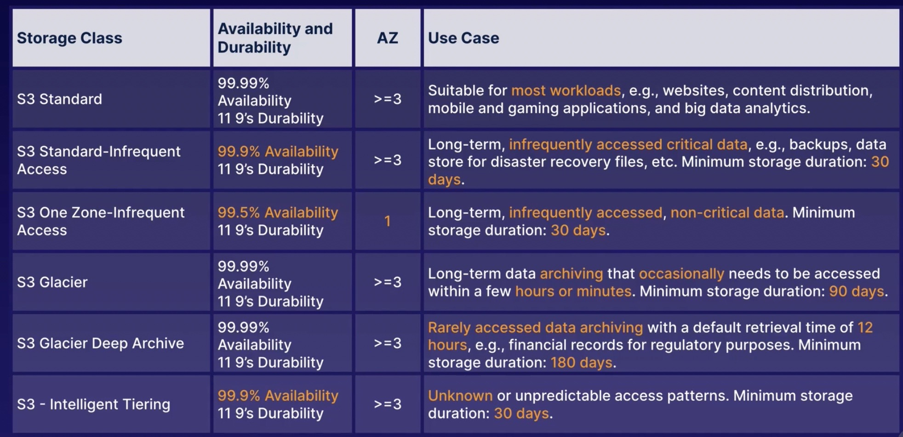
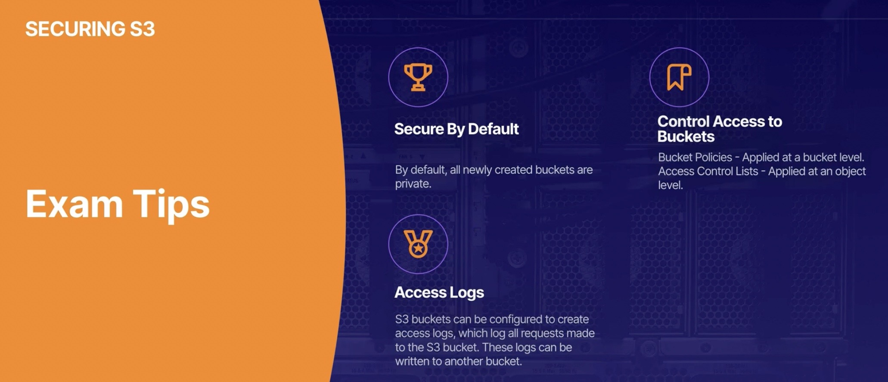
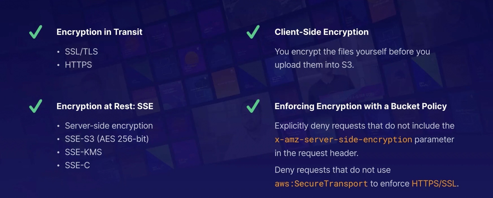

## S3 - Simple Storage Service


## 1. Storing class:
1. S3 - standard
2. S3 - standard infrequent access
3. s3 one zone - infrequent access
4. S3 - glacier
5. s3 - glacier deep archive
6. S3 - Inteligent tiering

## 📖 Exam Tips:
   

## 2. securing buckets
- Bucket policies:
    - bucket level
        - condition is applied to all the objects inside bucket
    - backet policies are written in JSON
        - Grant access to Application Load Balancer for enabling access logs
            ```
            {
            "Version": "2012-10-17",
            "Statement": [
                {
                "Principal": {
                    "AWS": "arn:aws:iam::elb-account-id:root"           
                },
                "Effect": "Allow",
                "Action": "s3:PutObject",
                "Resource": "arn:aws:s3:::DOC-EXAMPLE-BUCKET1/prefix/AWSLogs/111122223333/*"
                }
            ]
            }
            ```
        - Resouces?
            - The following common Amazon Resource Name (ARN) format identifies resources in AWS:
            ```
            arn:partition:service:region:namespace:relative-id
            ```
        - principals?
            - The Principal element specifies the user, account, service, or other entity that is allowed or denied access to a resource.
        - actions?
            - Amazon S3 defines a set of permissions that you can specify in a policy. These are keywords, each of which maps to a specific Amazon S3 operation.
        - conditions?
            - In the Condition element, you build expressions in which you use Boolean operators (equal, less than, etc.) to match your condition against values in the request. For example, when granting a user permission to upload an object, the bucket owner can require that the object be publicly readable by adding the StringEquals condition, as shown here.
            ```
            { 
            "Version": "2012-10-17",
            "Statement": [
                {
                "Sid": "statement1",
                "Effect": "Allow",
                "Action": "s3:PutObject",
                "Resource": [
                    "arn:aws:s3:::awsexamplebucket1/*"
                ],
                "Condition": {
                    "StringEquals": {
                    "s3:x-amz-acl": "public-read"
                    }
                }
                }
            ]
            }
            ```
- S3 access logs:
    - log all requests made to S3 Bucket
    - eg everytime a user makes a request to upload a file, read a file, or delete a file logs written into another s3 bucket.

## 📖 Exam Tips:
   


## 3. S3 ACLs and Bucket policies Demo :

#### Task:
- Create an S3 bucket
- Upload some files
- Configure an access control list
- Configure Bucket policy

Solution:


- Step 1: Creating bucket and Adding read permission at object level using ACL.
    - [Execute this template](./create-s3-with-read.yaml)
    -   This template creates an S3 bucket with default private access control, and a bucket policy that grants read access to anyone using the bucket's Access Control List (ACL). The policy allows anyone to read objects within the bucket using the s3:GetObject action, and applies to all objects within the bucket using the ARN arn:aws:s3:::<bucket-name>/*.

- Step 2: Adding bucket policy:
    - Use policy generator
    ```
    {
    "Version": "2012-10-17",
    "Id": "Policy1680801461291",
    "Statement": [
            {
                "Sid": "Stmt1680801431269",
                "Effect": "Allow",
                "Principal": {
                    "AWS": "arn:aws:iam::525155614444:user/karthik-test-iam"
                },
                "Action": "s3:ListBucket",
                "Resource": "arn:aws:s3:::tryne12345gfdgdfg"
            }
        ]
    }
    ```
    - this will allow user to access to list the bucket & files

## 💡Policy Generator: 
- https://awspolicygen.s3.amazonaws.com/policygen.html

## 4. S3 Encryptions:

### Types of encryption:
1. Encryption in transit
    - SSL/TLS
    - HTTPS

2. Encryption at Rest - server side encryption
    - SSE-S3 - S3 managed keys, using AES 256 bit encryption
    - SSE-KMS - aws management service managed keys
    - SSE-C - customer provided keys

3. Encryption at Rest - client side encryption
    - you encrypt the files yourself before you upload them into s3

### 1. Encryption at Rest - server side encryption 
- 1 way: using console
    - select the encryption on your s3 bucket
- 2nd way: busket policy
    - you can enforce encyption using bucket policy. this method does sometimes come up in the exam.

eg:

If a bucket is not configured with default encryption, uploaded files may not be encrypted. You may want to force the encryption of uploaded objects. This is feasible with a bucket policy. The following policy denies permission to upload an object unless the request includes the `x-amz-server-side-encryption` header to request server-side encryption:

```
{
  "Version": "2012-10-17",
  "Id": "PutObjectPolicy",
  "Statement": [
    {
      "Sid": "DenyIncorrectEncryptionHeader",
      "Effect": "Deny",
      "Principal": "*",
      "Action": "s3\:PutObject",
      "Resource": "arn\:aws\:s3:::awsexamplebucket1/*",
      "Condition": {
        "StringNotEquals": {
          "s3\:x-amz-server-side-encryption": "AES256"
        }
      }
    },
    {
      "Sid": "DenyUnencryptedObjectUploads",
      "Effect": "Deny",
      "Principal": "*",
      "Action": "s3\:PutObject",
      "Resource": "arn\:aws\:s3:::awsexamplebucket1/*",
      "Condition": {
        "Null": {
          "s3\:x-amz-server-side-encryption": "true"
        }
      }
    }
  ]
}

```

### 2. Enforcing Encryption in Transit:
- S3 Bucket Policy:
    - Youcan also create bucket policy that requires encyption of data in transit(eg. HTTPS/SSL)
    - This policy eplicitily  denies any requests that do not use `aws:SecureTransport`
```
{
  "Version": "2012-10-17",
  "Id": "ExamplePolicy",
  "Statement": [
    {
      "Sid": "AllowSSLRequestsOnly",
      "Effect": "Deny",
      "Principal": "*",
      "Action": "s3:*",
      "Resource": "arn:aws:s3:::mysecurebucket/*",
      "Condition": {
        "Bool": {
          "aws:SecureTransport": "false"
        }
      }
    }]
}
```

### 📖 Exam Tips:
   


## 3. CORS Configuration:
- Access resource/code from 1 S3  bucket to another code/resource in the other s3 bucket.
   

## 4. Cloudfront :
- Content delivery network
    - a system of distributed servers which deliver webpages and other web content.
- Terminology:
    1. cloudfront edge location
        - this is loc where content is cached. separate to an AWS region/AZ
    2. cloudfront origin
        - this is the origin  of all the files that the distribution will serve.
        - can be an S3 Bucket, EC2, load balancer or route53
    3. Cloudfront distribution
        - name given to origin and configuration settings for the content you wish to distribute using cloudfront(CDN)
- Time to live:
    - Objects are cached for a period of time which is thier time to live.
    - default - 1 day, once TTL is up, data is cleared
    - we can manually clear the data before TTL, but charged.

- S3 transfer acceleration:
    - cloudfront edge loc are utilized by S3 transfer acceleration to reduce latency for s3 uploads.

### TASK1 : Confuring cloudfornt
1. Create an s3 bucket
2. access the image from s3 bucket
3. create cloudfornt distribution
4. access the image using clodufront edge location
    - compare response time

### TASK2 : Confuring cloudfront with origin identity access
1. Create an s3 bucket
2. create cloudfornt distribution
    - create identity access
3. when distrinution is ready
    - check we can access the image using cloudfront
4. restrict access
    - remove public read access from our bucket
    - we should only be able to access the image using cloudfront URL.

## Ref:
- Encryption in AWS: https://catalog.us-east-1.prod.workshops.aws/workshops/aad9ff1e-b607-45bc-893f-121ea5224f24/en-US
