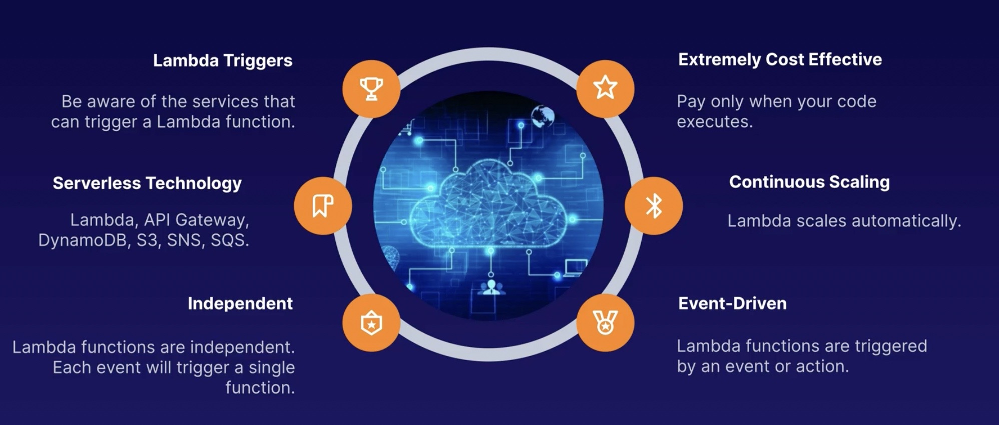
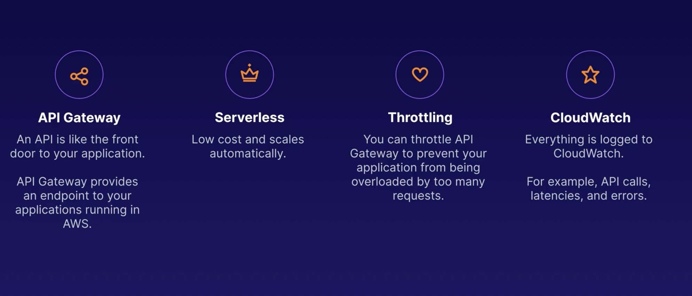
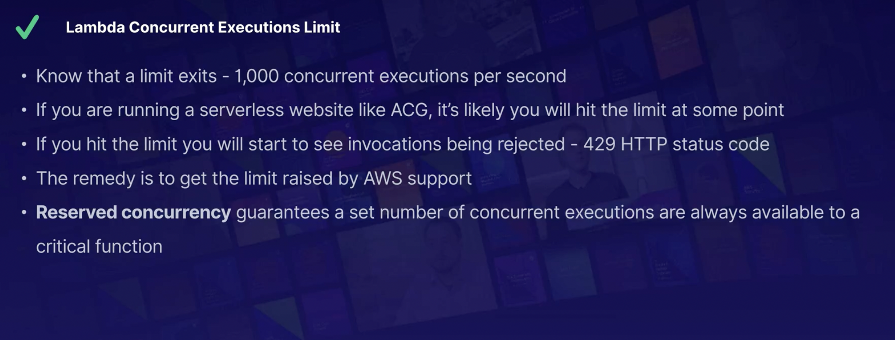
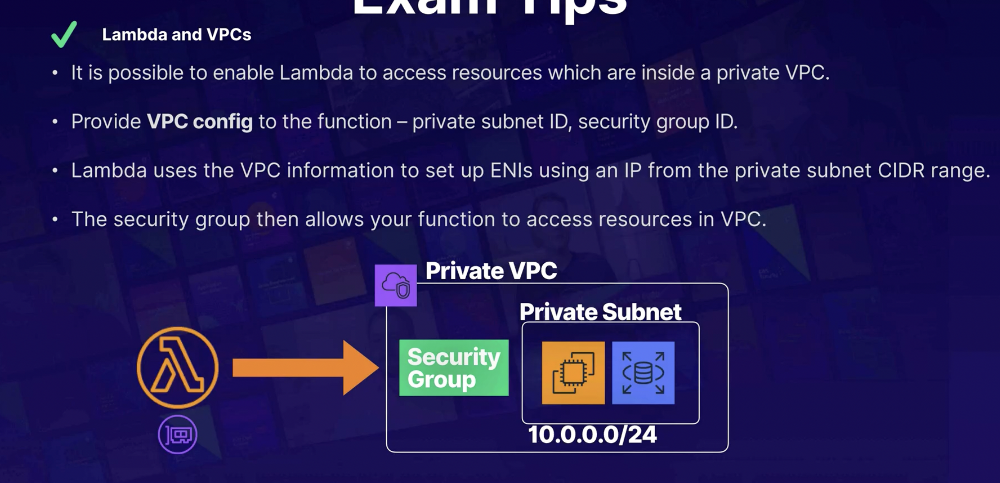

# Serverless

- Serverless enables you to build scalable applications quickly without managing any servers.
- Low cost: serverless applications are event-driven and you are only charged when code is executed.
- AWS Handles the heavy lifting 
    - focus only on writing code and building app and not the configuring servers.

### Serverless examples in AWS:
1. s3
2. DynamoDB
3. Lambda
4. SQS
5. SNS
6. API Gateway

## 1. LAMBDA
- Serverless compute
- langauge: Java, Go, Python, Nodejs, c#, Powershell & ruby
- exterprice features:
    - autoscaling & high availability are already linked to lamda

### Pricing:
- based on the no of request, duration, amount of memory used by your function
1. Requests
    - first 1 million request per month are free
    - $0.20 per month per 1 million requests
2. Duration     
    - 1 millisecond increments
    - price depends on amount of memory is allocated to your lambda function
3. price per GB-second
    - $0.00001667 per GB Second
    - functions that uses 512 MB and runs for 100ms
        - 0.5GB*0.1s = 0.05 GB-seconds
        - O.000000083
    - first 4L GB-seconds per month are free

### Event Driven architecture:
1. Event-driven:
    - function can be automatically triggered by the other AWS services or called directly from any web or mobile app.
2. Triggered by event
    - these events could be changes made to data in s3 bucket, or dynamoDB table
3. Triggered by user requests
    - you can use API Gateway to configure an HTTP endpoint allowing you to trigger your functions at any time using HTTP requets.

eg:
- Alexa runs on lambda
- triggered by voice

#### AWS services that invoke lambda functions are:
- dynmaoDB
- kineses
- SQS
- App load balancer
- API gateway
- Alexa
- Cloudfront
- S3
- SNS
- SES
- Cloudformation
- cloudwatch
- codecommit
- codepipeline

### 📖 Exam Tips:


## 2. API Gateway:
- Publish , maintain and monitor APIs at any scale
- A front door: An API is like a front door for app to access data, business logic, functionality from your backend services
    eg, applicaions running on ec2 , lambda
- Supported APIs types
    - RESTFull APIs:
        - optimised for staleless, serverless workloads, web applications
        - Supports JSONs
        - key-value pairs
    - Websocket APIs
        - real time, two way, statefull communication eg. chat apps

### 📖 Exam Tips:


Solution: [Checkout this](../Tasks/serverless/)

## 3: Version control with Lambda:`$LATEST`
- Manages multiple versions
- lambda aliases
- Task: [Refer](../Tasks/serverless/)

## 4: Concurrent execution limit in lambda:
- Default 1000 per region 
- TooManyRequestException
- HTTP STATUS code: 429
- request throughput limit exceeded
### 📖 Exam Tips:


## 5: Lambda and VPC Access:
- Enabling lambda access to VPC Resources:
    - some usecase require lambda to access resources which are incide a private VPC
    - eg. read or write to an RDS databases, or shut down an EC2 instance in response to security alert
- HOW ?
    - To anable this, we need to allow the function to connect to the private subnet
    - lambda needs the following VPC configuring information so that it can conect to the VPC:
        - Private subnet ID
        - Security group ID(with required access)
        - lambda uses this info to set up ENIs using an available IP address from your private subnet

using AWS CLI
```
aws lambda update-function-configuration --function-name my-function --vpc-config subnetIds=subnet-1121aabb, SecurityGroupIds=sg-51530134
```
### 📖 Exam Tips:


## 5: Step Function:
- Provides a visual interface for serverless applications, which enables you to build and run serverless applications as series of steps.
- each function will be in order
- sequential workflow
    - start -> decode base64 string -> generates statistics -> remove special characters -> tokenize and count -> end
- parallel flow 
    - start -> process photo -> (extract metadata , resize image, facial recognisation) -> load in database -> end

### 📖 Exam Tips:


## 6: Comparing step fuction workflows:
- Step functions:
    - strp functions provides various types of state machines that feature different workflows to cater to a verirty of tasks that you would like to orchestrate
    - the kind of task you are orchestrating determines the type of machine you should use

1. Standard workflows
    - `long running`: flows that run for up to year. full execution history available for up to 90 dats after completion
    - `At Most once model`: task that never execute more than once unless you explicitily specify retry actions.
    - `Non-Idempotent actions`: when processing payments, you only want a payment to be processed once, not multiple times
    - `Change in state?`: A request is non-idempotent if it always causes a change in state. (sending the same email multiple times causes a change in state bcoz you end up with multiplr emails in your inbox)

2. Express workflows: 
    - `Short-lived`: (Up to 5 minutes) great for hugh-volume, event-processing-type workflows
    - `At-least-once`: (Model) ideal if there is a possibility that execution might be run more than once or you require multiple concurrent executions
    - `Idempotent`: (actions) for example, transforming input data and storing the result in DynamoDB.
    - `Identical request` (has no side effect): A request is considered idempotent if an identical request can made once or several times in a row with no additional side effects (eg. reading data from database or s3 bucket)

3. Synchronous and asynchronous express workflows:
    - synchronous: beings a workflow -> waits until it completes -> return the results
    - asynchronous: begins a workflow -> confirms the workflow has strated-> result of workflow can be found in cloudwatch logs.

## 7. X-Ray:

