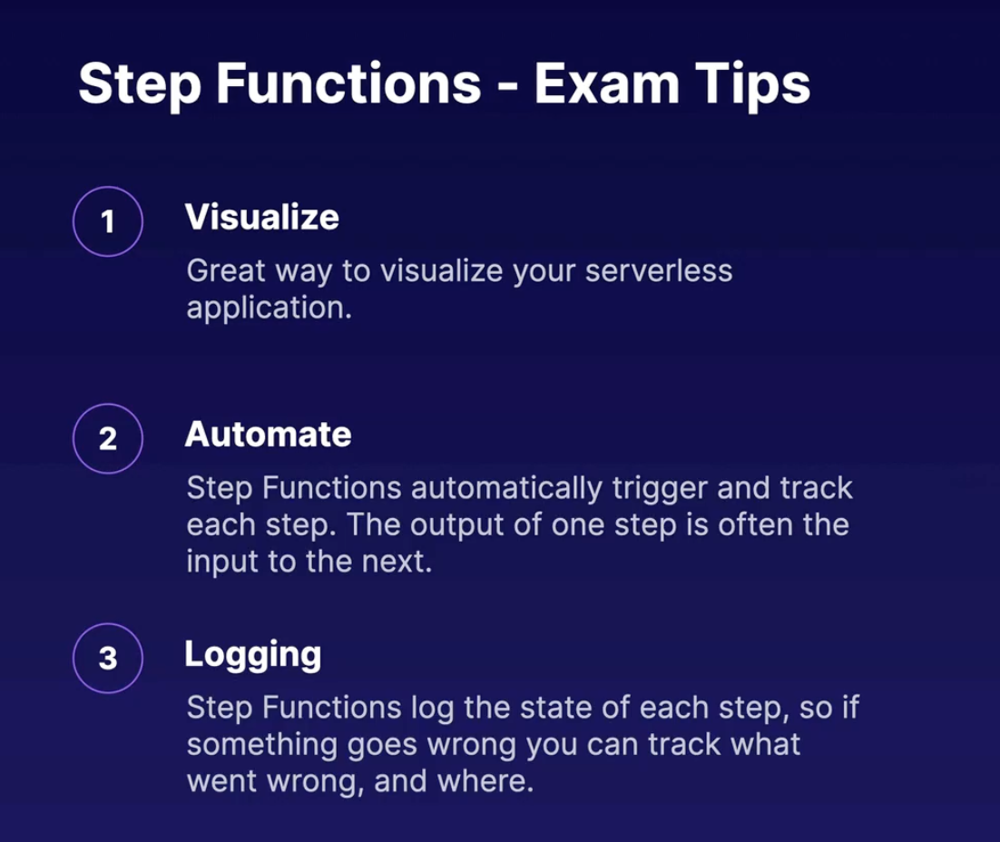

# Serverless

- Serverless enables you to build scalable applications quickly without managing any servers.
- Low cost: serverless applications are event-driven and you are only charged when code is executed.
- AWS Handles the heavy lifting 
    - focus only on writing code and building app and not the configuring servers.

### Serverless examples in AWS:
1. s3
2. DynamoDB
3. Lambda
4. SQS
5. SNS
6. API Gateway

## 1. LAMBDA
- Serverless compute
- langauge: Java, Go, Python, Nodejs, c#, Powershell & ruby
- exterprice features:
    - autoscaling & high availability are already linked to lamda

### Pricing:
- based on the no of request, duration, amount of memory used by your function
1. Requests
    - first 1 million request per month are free
    - $0.20 per month per 1 million requests
2. Duration     
    - 1 millisecond increments
    - price depends on amount of memory is allocated to your lambda function
3. price per GB-second
    - $0.00001667 per GB Second
    - functions that uses 512 MB and runs for 100ms
        - 0.5GB*0.1s = 0.05 GB-seconds
        - O.000000083
    - first 4L GB-seconds per month are free

### Event Driven architecture:
1. Event-driven:
    - function can be automatically triggered by the other AWS services or called directly from any web or mobile app.
2. Triggered by event
    - these events could be changes made to data in s3 bucket, or dynamoDB table
3. Triggered by user requests
    - you can use API Gateway to configure an HTTP endpoint allowing you to trigger your functions at any time using HTTP requets.

eg:
- Alexa runs on lambda
- triggered by voice

#### AWS services that invoke lambda functions are:
- dynmaoDB
- kineses
- SQS
- App load balancer
- API gateway
- Alexa
- Cloudfront
- S3
- SNS
- SES
- Cloudformation
- cloudwatch
- codecommit
- codepipeline

### 📖 Exam Tips:


## 2. API Gateway:
- Publish , maintain and monitor APIs at any scale
- A front door: An API is like a front door for app to access data, business logic, functionality from your backend services
    eg, applicaions running on ec2 , lambda
- Supported APIs types
    - RESTFull APIs:
        - optimised for staleless, serverless workloads, web applications
        - Supports JSONs
        - key-value pairs
    - Websocket APIs
        - real time, two way, statefull communication eg. chat apps

### 📖 Exam Tips:


Solution: [Checkout this](../Tasks/serverless/)

## 3: Version control with Lambda:`$LATEST`
- Manages multiple versions
- lambda aliases
- Task: [Refer](../Tasks/serverless/)

## 4: Concurrent execution limit in lambda:
- Default 1000 per region 
- TooManyRequestException
- HTTP STATUS code: 429
- request throughput limit exceeded
### 📖 Exam Tips:


## 5: Lambda and VPC Access:
- Enabling lambda access to VPC Resources:
    - some usecase require lambda to access resources which are incide a private VPC
    - eg. read or write to an RDS databases, or shut down an EC2 instance in response to security alert
- HOW ?
    - To anable this, we need to allow the function to connect to the private subnet
    - lambda needs the following VPC configuring information so that it can conect to the VPC:
        - Private subnet ID
        - Security group ID(with required access)
        - lambda uses this info to set up ENIs using an available IP address from your private subnet

using AWS CLI
```
aws lambda update-function-configuration --function-name my-function --vpc-config subnetIds=subnet-1121aabb, SecurityGroupIds=sg-51530134
```
### 📖 Exam Tips:


## 5: Step Function:
- Provides a visual interface for serverless applications, which enables you to build and run serverless applications as series of steps.
- each function will be in order
- sequential workflow
    - start -> decode base64 string -> generates statistics -> remove special characters -> tokenize and count -> end
- parallel flow 
    - start -> process photo -> (extract metadata , resize image, facial recognisation) -> load in database -> end

### 📖 Exam Tips:


## 6: Comparing step fuction workflows:
- Step functions:
    - strp functions provides various types of state machines that feature different workflows to cater to a verirty of tasks that you would like to orchestrate
    - the kind of task you are orchestrating determines the type of machine you should use

1. Standard workflows
    - `long running`: flows that run for up to year. full execution history available for up to 90 dats after completion
    - `At Most once model`: task that never execute more than once unless you explicitily specify retry actions.
    - `Non-Idempotent actions`: when processing payments, you only want a payment to be processed once, not multiple times
    - `Change in state?`: A request is non-idempotent if it always causes a change in state. (sending the same email multiple times causes a change in state bcoz you end up with multiplr emails in your inbox)

2. Express workflows: 
    - `Short-lived`: (Up to 5 minutes) great for hugh-volume, event-processing-type workflows
    - `At-least-once`: (Model) ideal if there is a possibility that execution might be run more than once or you require multiple concurrent executions
    - `Idempotent`: (actions) for example, transforming input data and storing the result in DynamoDB.
    - `Identical request` (has no side effect): A request is considered idempotent if an identical request can made once or several times in a row with no additional side effects (eg. reading data from database or s3 bucket)

3. Synchronous and asynchronous express workflows:
    - synchronous: beings a workflow -> waits until it completes -> return the results
    - asynchronous: begins a workflow -> confirms the workflow has strated-> result of workflow can be found in cloudwatch logs.

## 7. X-Ray:
- Tool Which helos developers analyse abd debug distributed applications.
- Allowing you to troubleshoot the root cause of performance issues and errors
- Provides a visualisation of your application's underlying components.
- X-Ray service map:
    - it provides end-to-end view of requests as they travel through your appliocations. This information can be used to troubleshoot connectivity and performance.
- X-Ray Integration:
    1. `aws services`: EC2, Elastic container service, Lambda, Elastic beanstack, SNS,SQS, DynamoDB, Elastic load balancer and API gateway.
    2. `Integrate with your apps`:   app written in java, nodejs, .net,ruby,python.
    3. `API calls`:   captures metadata for API Calls made to AWS services using the AWS SDK.
- X-Ray Architecture:
    1. Install the x-ray agent:
        - install agent on your EC2 instance
    2. Configure
        - instrument your application using the x-ray sdk
    3. X-Ray SDK
        - x-ray sdk gathers information from your request and response headers, the code in your application, and metadata about the AWS resoirces on which it runs, and sends this trace data to X-ray . eg. incoming HTTP requests, errors codes, latency data.

## 8: X-Ray configurations:

- The aws x-ray sdk sends the data to the x-ray daemon which buffers segments into a queue and uploads them to x-ray in batches
- you need both x-ray sdk and the x-ray daemon on your systems

- X-RAY high level configurations:
    1.  on premises & ec2 instance:
        - ionstall the x-ray daemon on your ec2 instances or on-premises server.
    2. elastic beanstalk
        - install the x-ray daemon on the ec2 instances inside your elastic beanstalk environment
    3. Elastic container service
        - install the x-ray daemon in its own docker container on your cluster alongside your app.
- Annotations & indexing:
    1. Annotations:
        - when instrumenting your applications, you can record additional information about requests by using annotations.
    2. key-value pairs:   
        - annotations are simple key-value pairs that are indexed for use with filter expressions, so that you can serach the traces that contain specific data and group related traces together in the console. eg game_name=TicTacToe, game_id=2645445842     

## 9: Advanced API Gateway:
- You can import APIs using external definitaion files, eg, openAPI, formely known as swagger.
- supported protocals: OpenAPI, formally swagger
- HOW ?:
    - create API GATEWAY
    - click on the import api and upload swagger file under HTTP API
    - deploy
- when dealing with legacy applications which use SOAP, you can configure API gateway as SOAP web service passthrough, or you can use API gateway to convert the XML response to JSON.

## 9: API Gateway caching and throttling:
- API Gateway caching:
    1. caches your endpoints responses
        - `this reduces the number of calls` made to your applications and can also improve the latency for your requests to your API.
    2. `TTL`:
        - when you enavle caching, API gateway caches responses from your endpoint for a specified TTL period, onseconds. The default is 300 seconds
    3. API gateway returns cachhed response:
        - API gateway then responds to new requests by looking up the response from cache, instead of making a new requests to your applications.
- WHAT is API gateway caching?
    - API gateway can help you improve the `performance` of your APIs , and the latency your end users experience, by caching the outout of API calls to avoid calling your backend applications everytime.
- API gateway account level throlling:
    - The purpose of API gateway throttling is to prevent your API from being overwhelmed by too many requests.
        - `Default limits`: limits steady-state request rate to `10,000 requests per second`, per regions
        - `concurrent request`: maximum concurrent requtes is `5000 requests` accross all APIs per region. You can request an increase on these limits
        - `429 Error`: id you exceed 10000 reqyest per seond, or 5000 concurrent requests, you will receive a `429 too many request` error
- throlling example:
    - 10K requests in the first milliseconds
    - 5k served : api gateway serves 5k of those requests immidiately
    - 5k throlling: it throlles the rest, within the 1 second period
- API gateway throlling example:
    1. 5K initial requests:
        - you receive 5k requests in the first milliseconds and then another 5k requests eventually spread thorughtout the remaining 999 milliseconds
    2. within th elimit::
        - this is till withing th eper region limit of 10k requests per second, and 5k concurrent requests.
    3. Process all requests:
        - API gateway proceses all 10k requests in the one-second period, without returning an error.


## References:
- AWS Certified Developer Associate Interactive Study Guide: Introduction to Serverless Computing - Part 2, https://acloudguru.visme.co/view/vd73kpyd-aws-certified-developer-associate-studyguide-s05-serverlesssummary-part2

-  Serverless 101, AWS Certified Developer Associate Interactive Study Guide: Introduction to Serverless Computing - Part 1, https://acloudguru.visme.co/view/rxep030o-aws-certified-developer-associate-studyguide-s05-serverlesssummary-part1

-  Serverless 101, PDF, https://acloudguru-content-attachment-production.s3-accelerate.amazonaws.com/1609880755229-S5_L1_SERVERLESS_101.pdf

-   Introducing Lambda, Lambda Documentation, https://docs.aws.amazon.com/lambda/latest/dg/lambda-services.html

-  Introducing Lambda, PDF, https://acloudguru-content-attachment-production.s3-accelerate.amazonaws.com/1609880847396-S5_L2_LAMBDA.pdf

-  Introducing Lambda, AWS::Lambda::Function, https://docs.aws.amazon.com/AWSCloudFormation/latest/UserGuide/aws-resource-lambda-function.html

-  API Gateway, Setting up a stage using the API Gateway console, https://docs.aws.amazon.com/apigateway/latest/developerguide/stages.html

-  API Gateway, PDF, https://acloudguru-content-attachment-production.s3-accelerate.amazonaws.com/1609880921530-S5_L3_API_GATEWAY.pdf

-  API Gateway, AWS - API Gateway structure, https://docs.aws.amazon.com/apigateway/api-reference/

-  Building a Serverless Website - Demo, Serverless Website Demo Code, https://github.com/ACloudGuru-Resources/course-aws-certified-developer-associate/tree/main/Serverless_Webite_Demo

-  Building a Serverless Website - Demo, PDF, https://acloudguru-content-attachment-production.s3-accelerate.amazonaws.com/1609881008086-S5_L4_BUILDING_A_SIMPLE_SERVERLESS_WEBSITE_DEMO%20%28Rebecca%20Gibbs%27s%20conflicted%20copy%202020-10-08%29.pdf

-  Version Control With Lambda - Demo, GitHub Repository - Version 1 and 2 code, https://github.com/ACloudGuru-Resources/course-aws-certified-developer-associate/tree/main/Version_Control_With_Lambda

-  Lambda Concurrent Executions Limit, PDF, https://acloudguru-content-attachment-production.s3-accelerate.amazonaws.com/1609881476736-S5_L6_LAMBDA_LIMITS.pdf

-  Lambda and VPC Access, PDF, https://acloudguru-content-attachment-production.s3-accelerate.amazonaws.com/1609881600745-S5_L7_LAMBDA_%26_VPCs_edited.pdf

-  Step Functions - Demo, PDF, https://acloudguru-content-attachment-production.s3-accelerate.amazonaws.com/1609882015226-S5_L9_STEP_FUNCTIONS.pdf

-  Step Functions - Demo, AWS Step Functions FAQs, https://aws.amazon.com/step-functions/faqs/

-  Comparing Step Functions Workflows, Standard vs Express Workflows, https://docs.aws.amazon.com/step-functions/latest/dg/concepts-standard-vs-express.html

-  Understanding X-Ray, PDF, https://acloudguru-content-attachment-production.s3-accelerate.amazonaws.com/1609882221674-S5_L10_X-RAY.pdf

-  Understanding X-Ray, X-Ray Zip File, https://acloudguru-content-attachment-production.s3-accelerate.amazonaws.com/1601287080555-aws-cda-2020-x-ray-resources.zip

-  Understanding X-Ray, AWS X-Ray FAQs, https://aws.amazon.com/xray/faqs/

-  Understanding X-Ray, Integrating AWS X-Ray with other AWS services, https://docs.aws.amazon.com/xray/latest/devguide/xray-services.html

-  Understanding X-Ray, X-Ray Link, https://console.aws.amazon.com/elasticbeanstalk/#/newApplication?applicationName=scorekeep&solutionStackName=Java

-  X-Ray Configuration, PDF, https://acloudguru-content-attachment-production.s3-accelerate.amazonaws.com/1609882338464-S5_L11_X-RAY_CONFIGURATION_STEPS.pdf

-  Advanced API Gateway, PDF, https://acloudguru-content-attachment-production.s3-accelerate.amazonaws.com/1609882387213-S5_L12_ADVANCED_API_GATEWAY.pdf

-  Advanced API Gateway, How to configure Amazon API Gateway as a SOAP webservice passthrough in minutes, https://blog.joshuamoesa.com/2017/06/how-to-configure-amazon-api-gateway-as.html

-  API Gateway Caching and Throttling, Amazon API Gateway REST API Reference: Signing Requests, https://docs.aws.amazon.com/apigateway/api-reference/signing-requests/

-  API Gateway Caching and Throttling, Enabling API caching to enhance responsiveness, https://docs.aws.amazon.com/apigateway/latest/developerguide/api-gateway-caching.html

-  Serverless Summary - Part 1, PDF, https://acloudguru-content-attachment-production.s3-accelerate.amazonaws.com/1609882437887-S5_L13_SERVERLESS_SUMMARY.pdf

-  Serverless Summary - Part 1, AWS Certified Developer Associate Interactive Study Guide: Introduction to Serverless - Part 1, https://acloudguru.visme.co/view/rxep030o-aws-certified-developer-associate-studyguide-s05-serverlesssummary-part1

-  Serverless Summary - Part 1, AWS Certified Developer Associate Interactive Study Guide: Introduction to Serverless - Part 2, https://acloudguru.visme.co/view/vd73kpyd-aws-certified-developer-associate-studyguide-s05-serverlesssummary-part2